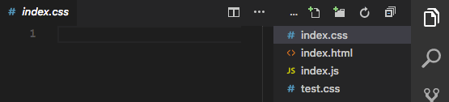

# File Switcher

An extension that helps you quickly switch between similarly named files.

## Features

You can cycle between files with the same base name, but different extensions using **ctrl + alt + f**:

> Tip: Many popular extensions utilize animations. This is an excellent way to show off your extension! We recommend short, focused animations that are easy to follow.

## Extension Settings

This extension contributes the following settings:

* `fileSwitcher.cycleExtensions`: An array of the extensions the cycle-extensions command will cycle through

## Known Issues

* When running the command the first time, there is a short delay as the extension is loaded.

## Release Notes

Users appreciate release notes as you update your extension.

### 1.0.0

Initial release of ...

### 1.0.1

Fixed issue #.

### 1.1.0

Added features X, Y, and Z.

-----------------------------------------------------------------------------------------------------------

## Working with Markdown

**Note:** You can author your README using Visual Studio Code.  Here are some useful editor keyboard shortcuts:

* Split the editor (`Cmd+\` on OSX or `Ctrl+\` on Windows and Linux)
* Toggle preview (`Shift+CMD+V` on OSX or `Shift+Ctrl+V` on Windows and Linux)
* Press `Ctrl+Space` (Windows, Linux) or `Cmd+Space` (OSX) to see a list of Markdown snippets

### For more information

* [Visual Studio Code's Markdown Support](http://code.visualstudio.com/docs/languages/markdown)
* [Markdown Syntax Reference](https://help.github.com/articles/markdown-basics/)

**Enjoy!**
